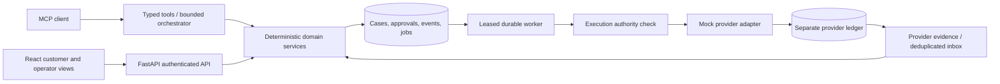

# Architecture

## Persistence and recovery

SQLite WAL is the default credential-free development database. SQLAlchemy Core uses the same tables with PostgreSQL. Case mutations, version increments, events, and notification outbox rows are committed together. Every job has an attempt count, due time, and 30-second wall-clock lease. Abandoned leases can be reclaimed on restart. The business clock is persisted separately and advances only through the simulator controls.

The API persists an immutable pending action before approval. Approval is tied to its payload digest, authenticated customer session, recipient version, challenge, and expiry. Execution verifies authority again before dispatch and records approval consumption. Provider calls happen outside the case transaction. Initiation and follow-up operations use stable client references, and the mock provider records idempotency separately. A resumed action first looks up the original reference. It cannot blindly create a replacement while an outcome remains unresolved.

Case state and transfer intent share a record in this small MVP. Typed validated fields and snapshots are serialized in JSON text with indexed ownership, lifecycle, reference, and uniqueness columns. Original quotes, approved payloads, incoming events, and interpreted receipts remain distinct records. This portable representation is intentionally simpler than a fully normalized production financial database.

## Evidence

Funding references are stored independently from recipient payout references. An arrival requires a final INR amount, provider payout reference, source USD debit, and fee. Every amount is compared to the approved quote. An underpayment or debit/fee mismatch opens `manual_review`; it is never successful reconciliation. A confirmed cancellation is also distinct from the later source refund.

At-least-once provider events are deduplicated by provider and event ID. Reuse of an ID with a changed payload is rejected. Invalid transitions are retained as deferred inbox events for operator inspection. An operator can replay the same event identity and content but cannot synthesize authorization.

## Agent boundary

The HTTP MCP surface pins protocol revision 2025-06-18 and supports initialization, ping, tool listing, tool calls, and initialized notifications using stateless JSON responses. There is no SSE subscription or A2A runtime. Tools expose provenance, retrieval time, and `environment=mock`. Read tools cannot initiate a transfer. The `prepare_transfer` tool can only create an approval draft after explicit recipient confirmation.

The built-in concierge runs rules-only and performs at most one bounded read per response. `agent/model.py` defines the optional structured model interface and a maximum-five-call dispatcher. Arbitrary provider text and document content never become tool permissions, approval records, or executable instructions. There is no approval tool in the model allowlist.

## Authentication and operational limits

A synthetic login creates a random, expiring server-side session. The browser uses an HttpOnly same-site cookie; MCP clients can use a bearer token. Customer IDs are checked at every case, document, recipient, transfer, and action lookup. Operators have a distinct demo session and cannot approve on the customer's behalf.

Mock callbacks require an HMAC-SHA256 signature. The default mock secret is public local fixture configuration; it is not a live provider credential. The callback endpoint is mock-only. Requests from foreign browser origins are rejected. Do not expose the development server to the public internet as a financial service.

The worker's outbox notification consumer currently acknowledges records locally. It does not send messages to customers. Pending, failed, customer-waiting, provider-waiting, and reconciled counts, queue age, abandoned approvals, and tool latency/cost are visible through the operations API. Production telemetry and real provider SLAs are not claimed.
