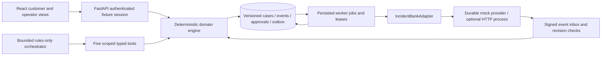

# Architecture and trade-offs

The server is authoritative. An incident's state is derived from independent instrument and transaction substates. Customers cannot send arbitrary status transitions. Approval only authorizes the immutable action payload displayed in the review dialog. Approvals bind the authenticated customer, payload SHA-256, challenge, and expiry. Expected versions protect concurrent updates; executor checks protect the final side effect. Customer statement changes invalidate pending drafts/approvals and are rejected once a report might have been submitted.

The worker commits a pending action before touching a provider. Claiming work creates a real-time lease; approval consumption and dispatch state are durable. Provider I/O is outside the database transaction. A successful acknowledgment is followed by provider status lookup. If the provider accepted before a timeout or process restart, the new worker reconciles the original request. If no result can be established after approval consumption, manual review is required. It does not generate another write. Reads use bounded retries with capped exponential delay. Independent institutions proceed independently.

The mock provider's durable ledger has a unique request reference and payload digest. Northstar lock operations require an explicit simulated direct-authentication completion. Responses carry their source, retrieval time, mock environment, scope, and reference. Application callbacks require an HMAC SHA-256 signature. Inbox events are unique by provider/event ID; altered replays, wrong-customer events, wrong instrument references, wrong transaction references, and stale revisions are rejected. A normal replay is a no-op.

Protection, replacement, and credit outcomes are distinct. A provisional credit keeps an investigation open. Final outcomes require a matching bank case reference. An incident cannot close until every card has verified protection, lost-card reporting and delivered replacement evidence; every transaction is recognized or finally resolved; and every recovery task has a customer attestation. A later credit reversal reopens the investigation and preserves the prior closed-state event.

Amounts are integer USD cents. The trusted registry supplies all outbound destinations and capability claims. Provider text and user statements are data; the orchestrator never treats them as instructions. The assistant cannot approve, unlock a card, change permissions, or close a case. It is explicitly rules-only and has a four-tool-call budget; a model-provider protocol exists for a future implementation.

## Provider capabilities

**Cedar Credit:** fictional credit issuer; temporary lock, lost-card report, replacement, charge investigation and information response. Temporary locks can leave recurring, pending and offline transactions unaffected. The fixture follow-up is 14 days after discovery.

**Northstar Bank:** fictional debit bank; temporary lock after a direct-authentication handoff, lost-card report, replacement, charge investigation and information response. The fixture follow-up is two days after discovery.

Both use the same request-reference lookup contract and support fault injection. The registry never accepts a replacement contact URL from a customer message. The two fixture reporting schedules are demonstrations, not legal deadlines. Official reference links are preserved separately from the fixture profiles.

## Storage and deployment boundaries

The first schema uses an incident JSON aggregate with independent instrument, transaction and task arrays, plus normalized action, approval, event, job, inbox, session, provider ledger and tool-run tables. Case versions prevent lost writes. SQLite/WAL is the tested zero-setup default. A generated PostgreSQL schema and Docker configuration are included but were not runtime-tested here. No Redis, Temporal, external credentials or model keys are required.

The default unauthenticated demo-session endpoint is appropriate only for this single synthetic customer. Cookies are HTTP-only and SameSite Strict; mutation origins are checked; API responses are not cached. There is no real identity proofing. The operator console shares the demo customer's scope. Production roles, storage encryption, uploads, key management, real provider onboarding and real-time monitoring require additional implementation.

## References consulted

- [MCP tools, protocol 2025-11-25](https://modelcontextprotocol.io/specification/2025-11-25/server/tools)
- [FastAPI security](https://fastapi.tiangolo.com/tutorial/security/first-steps/)
- [CFPB lost credit-card guidance](https://www.consumerfinance.gov/ask-cfpb/am-i-responsible-for-unauthorized-charges-if-my-credit-cards-are-lost-or-stolen-en-29/)
- [CFPB unauthorized bank-account transactions](https://www.consumerfinance.gov/ask-cfpb/how-do-i-get-my-money-back-after-i-discover-an-unauthorized-transaction-or-money-missing-from-my-bank-account-en-1017/)

The legal-reference pages provide implementation context only. No statutory countdown or liability estimate is calculated by this prototype.
