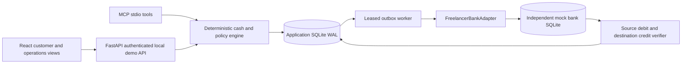

# Architecture and invariants

## Financial model

Every fiat amount is an integer number of USD cents. Tax fractions are fixed-precision decimal strings. Eligible receipts are confirmed earned income, net of linked confirmed refunds; own transfers, loans and uncertain receipts never accrue an income tax allocation. Allocations are recalculated as per-receipt targets rather than incremented on every planning run. Confirmations retain the previous interpretation and immutable provider evidence ID.

`capacity = max(0, available cash − provisional tax target − confirmed operating commitments − emergency floor − unmatched local reservations)`

`feasible = min(requested, capacity)`

Available cash already excludes bank holds. Accepted mock transfers do not introduce a second bank hold; their amounts remain in the application's reserved bucket until a posted debit is verified. The mock bank separately enforces pending outgoing capacity at acceptance.

Bucket journal lines sum to zero, including a `bank_control` counterpart for external cash movement. The five positive cash buckets always sum to available bank cash. Internal reclassification does not change bank cash. If targets exceed available cash, capacity is zero, the engine reports a reserve deficit, and funded allocations are capped at cash instead of inventing negative cash. A transfer removes its reserved amount and bank cash together. A return adds a new compensating journal.

Bank status and balance reads are retried up to three times if account versions change mid-observation, avoiding mixed pre/posting snapshots. Reconciliation checks reference, account identity, sign, amount and both entries. Contradictory evidence never completes a case.

## Authorization and concurrency

A draft is immutable and hashed using canonical JSON. Its challenge binds the exact payload and case version and expires at a fixture-clock deadline. Approvals record authenticated actor, hash, scope, expiry, consumption, and revocation. Customer input revisions and bank versions are rechecked by the executor immediately before a write. The assistant has no approval tool.

All financial application mutations take one SQLite write lock. Concurrent approvals therefore cannot reserve the same flexible cash twice. Provider writes happen after committing the pending action, approval consumption, and transactional outbox. A unique request reference stays constant across restarts; the provider rejects reference reuse with different content. Database indexes enforce action idempotency and transfer reference uniqueness.

The worker lease lasts 30 real seconds; polling of accepted transfers is spaced by two seconds. Errors back off exponentially, capped at 60 seconds. Three repeated exceptions hold the job for manual review. The reserved funds remain held. An operator can requeue the original job, but the executor still checks original approval and evidence. A confirmed absent transfer with expired authority releases the reservation; an accepted transfer found after approval expiry is still reconciled because submission already occurred.

## Persistence

`migrations/001_initial.sql` is applied idempotently. `entities` holds versioned JSON aggregates and domain records with tenant/customer indexes. Dedicated append-only tables capture case transitions and conserving journal lines. `event_inbox` deduplicates provider IDs and rejects changed payloads with the same ID. `outbox` stores action jobs with leases, attempts, errors and review holds. `tool_runs` stores tool names, redacted field names, outcome, engine version and zero model cost; it never stores hidden reasoning.

Provider event HMAC uses SHA-256 over `timestamp + '.' + raw_body`; timestamps have a five-minute real-time replay window. Callback payloads are signals only: actual bank lookup determines the outcome. Operator replay cannot create or approve a new transfer. There is no external notification delivery integration.

## Capabilities

The installed mock adapter supports available-cash snapshots, posted entries, same-owner transfers, lookup by original reference, acceptance-before-timeout, delayed posting, declines, malformed responses and returns. Every result is labeled `environment=mock` and `authority=simulated`. Sandbox and production adapters are absent. A2A is outside this implementation. The adapter interface is synchronous because these operations use local SQLite; an eventual network adapter should add async I/O or thread offloading at this boundary.

## Protocol references

MCP tool schemas and result metadata follow the [2025-11-25 tools specification](https://modelcontextprotocol.io/specification/2025-11-25/server/tools). The implementation advertises only tools over stdio, with no remote HTTP transport. FastAPI exposes validated request models and dependency-based session checks; see its [security documentation](https://fastapi.tiangolo.com/tutorial/security/simple-oauth2/) for the underlying framework mechanisms. This prototype's demo session is not an OAuth deployment.
