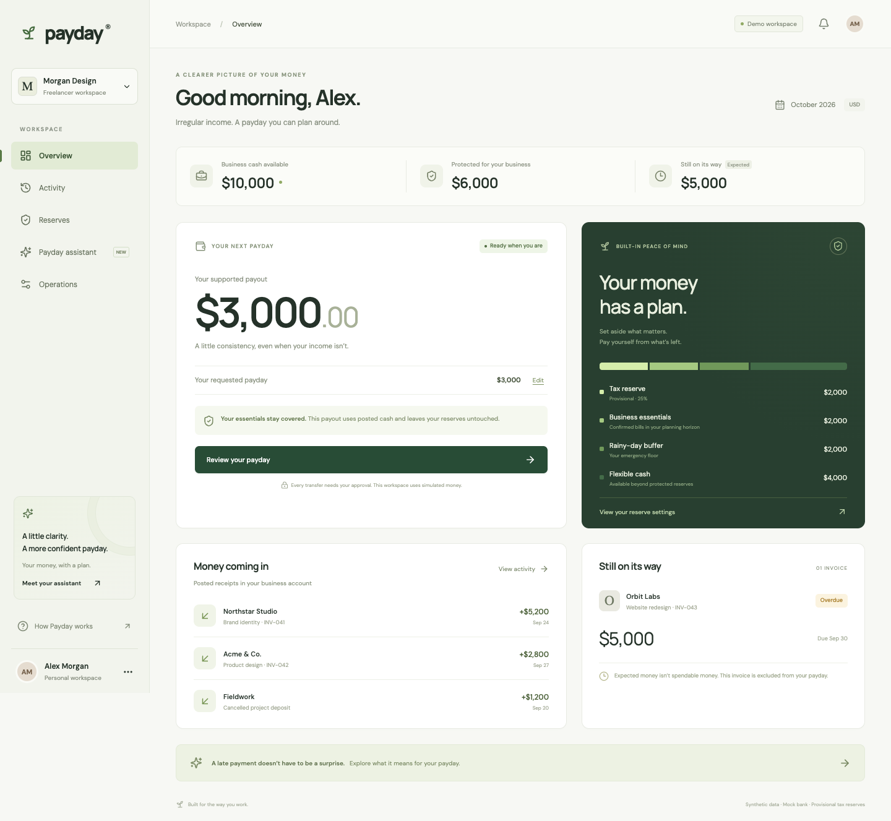

# Implementation Guide

The detailed implementation guide below was imported with the application. Previously recorded evaluation and Docker/browser results retain their original scope; see [Testing](testing.md) for the checks rerun during this publication.

# Freelancer Payday Agent

A working, US-first, USD freelancer cash-management prototype. It turns posted business cash into a reviewed personal payday, protects approved reserves, executes one approved mock transfer, and reconciles both bank entries and virtual buckets.

**All customers, invoices, accounts, and transfers are synthetic.** The assistant runs a deterministic tool-selection policy; it does not require an LLM API key. The provisional tax percentage is a user-supplied planning input, not a tax estimate.



## Run locally

Requires Python 3.9+ and Node 20.19+ (or Node 22). From this project directory:

```sh
./scripts/dev.sh
```

Open **http://127.0.0.1:8012**. The script installs pinned dependencies, builds the UI, seeds an idempotent fixture, and runs the API plus durable worker. Ctrl-C stops both processes. First setup requires package-registry access; the resulting app runs locally. Google Fonts are optional and fall back to system fonts offline.

For subsequent starts without reinstalling or rebuilding:

```sh
# Terminal 1
.venv/bin/python -m uvicorn backend.app.main:app --host 127.0.0.1 --port 8012
# Terminal 2
.venv/bin/python -m backend.app.worker
```

For frontend development, run `npm run dev --prefix frontend` alongside the API. The Vite proxy connects to port 8012. Durable state lives in `data/`; use a different `PAYDAY_DATA_DIR` to start a separate workspace without erasing any history.

Optional container packaging:

```sh
docker compose up --build
```

The Compose setup shares a persistent SQLite volume between API and worker. The bank simulator uses a second, independent SQLite database. Container configuration is supplied; the measured checks below were run natively on macOS, not inside Docker.

## What you can do

- **Overview:** inspect requested versus supported pay, protected cash, posted receipts, and the overdue invoice. Edit the requested amount and review an exact transfer.
- **Activity:** confirm ambiguous receipt categories, inspect immutable provider evidence, and follow case transitions.
- **Reserves:** review provisional tax, confirmed bills, and the emergency floor. Policy changes require a separate exact review.
- **Payday assistant:** ask for a plan, receipt classification, or reconciliation. Five scoped tools have no approval capability. Every call records evidence metadata and a bounded tool budget.
- **Operations:** inject delayed posting, acceptance followed by timeout, declines, malformed responses, an overdue client's payment, or a returned payout. Inspect jobs, bank references, and balanced journals.

A transfer review binds the source, same-owner destination, amount, currency, cash snapshot, policy version, and simulator behavior. Approval expires after 15 minutes of the controllable **fixture clock**. Cash or policy changes invalidate affected unsubmitted approvals. A timeout retains its reservation until the original bank request reference is resolved.

## Measured validation

On 26 September 2026:

- **42 backend tests passed:** integer-cent calculations, unpaid invoices, own transfers/refunds, holds, duplicate imports, concurrency, exact-action approval, expiry/revocation, policy invalidation, authentication, tenant isolation, HMAC callbacks, worker restart, bounded failure escalation, posting, and returns.
- **30/30 labeled assistant evaluations passed**, including **6 held-out cases**; these check state, evidence, tool budgets, and absence of self-approval. The direct deterministic workflow is the baseline. No external model comparison was run; model cost is $0.00.
- **3 browser tests passed:** complete customer journey and failure recovery, mobile overflow/navigation, and reviewed policy updates surviving reload.
- TypeScript and the production frontend build passed. The patched npm dependency audit reported **0 vulnerabilities** at install time.

These are synthetic prototype results, not customer success rates. Full evaluation records are in [docs/evaluation-report.json](evaluation-report.json). Screenshots are in [docs/screenshots](https://github.com/vaibhavkapur/Personal-Finance-Agents/tree/main/projects/Freelancer-Payday-Agent/docs/screenshots).

```sh
.venv/bin/python -m pytest -q
.venv/bin/python -m scripts.evaluate
.venv/bin/python -m scripts.demo
npm run build --prefix frontend
npm run test:e2e --prefix frontend
```

Browser tests use local Chrome on macOS and an isolated temporary database at port 8013. For another Chrome installation set `PLAYWRIGHT_CHROME_PATH` to its executable. No browser download is required.

## Three reproducible demos

`python -m scripts.demo` runs all three in isolated temporary databases, verifies conservation, and prints actual provider evidence references:

1. **Supported payday:** $10,000 cash; $2,000 each in provisional tax, operating, and emergency targets; $4,000 capacity. A $3,000 payout leaves $7,000 bank cash and $1,000 flexible cash.
2. **Client pays late:** a posted $2,500 business expense reduces available cash to $7,500. The unpaid $5,000 invoice stays excluded; supported payday falls to $1,500. A later posted invoice receipt adds $5,000 cash and $1,250 provisional tax allocation, revising capacity.
3. **Transfer returned:** the original debit and credit remain in history. New compensating entries restore both accounts and the buckets; the case enters `recovery_review` and requires a fresh payout review.

For the browser equivalent, use Operations to change the next transfer behavior before opening a review. After an accepted timeout, click **Post pending bank transfers** to simulate the delayed provider event. Advancing the fixture clock controls approval deadlines; worker leases use real wall-clock deadlines so restart recovery does not depend on fixture time.

## API and MCP

The live OpenAPI reference is at **http://127.0.0.1:8012/docs**. Customer APIs require an HTTP-only, same-site demo session (created by the local UI) or `Authorization: Bearer <token>`. The generated local token is kept in `data/session.key`; do not commit it. Browser requests are restricted to configured local origins. Local demo login intentionally impersonates one synthetic user and is **not production identity verification**.

MCP uses newline-delimited JSON-RPC on stdio, pinned to revision **2025-11-25**:

```sh
.venv/bin/python -m backend.app.agent.mcp
```

Example client configuration (replace the two absolute paths):

```json
{
  "mcpServers": {
    "freelancer-payday": {
      "command": "/absolute/path/freelancer-payday-agent/.venv/bin/python",
      "args": ["-m", "backend.app.agent.mcp"],
      "cwd": "/absolute/path/freelancer-payday-agent",
      "env": {"PAYDAY_DATA_DIR": "/absolute/path/freelancer-payday-agent/data"}
    }
  }
}
```

Tools: `get_verified_cash_snapshot`, `classify_receipts`, `calculate_payout`, `prepare_payday_transfer`, `reconcile_payday`. Results carry source, retrieval time, USD, simulated authority, and environment. Only the authenticated customer API can approve. The stdio process is trusted local access to the synthetic tenant; no remote MCP authentication or transport is claimed.

## Implementation choices and boundaries

- **FastAPI + Pydantic; React + TypeScript.** Pinned Python dependencies including transitive packages are in `requirements.lock`; npm's full lock is committed.
- **SQLite WAL instead of PostgreSQL for this single-user prototype.** `BEGIN IMMEDIATE` serializes financial updates across processes. A versioned customer aggregate contains receipts, bills, invoice links, policy, and balances; indexed entity records hold cases, proposals, actions, approvals, and transfers. Dedicated tables hold journals, events, inbox, outbox, and tool runs. This is a deliberate departure from the suggested normalized PostgreSQL schema, not a production-scale persistence claim.
- **Durable leased worker.** It queries the original request reference before a retry, rechecks authority before submission, persists approval consumption and pending work, calls the provider outside application transactions, then verifies both account entries. Three repeated provider errors hold the job for review with its reservation intact. The operator retry API only requeues the original action and cannot bypass its approval.
- **Independent mock provider only.** No Plaid credentials, live banking, payroll, lending, tax filing/remittance, A2A accountant agent, or production deployment is included. The adapter protocol and capability flags make those boundaries explicit. The mock ledger lives in-process behind an adapter, in a separate durable database rather than a separate network service.
- **Rules-only assistant.** `StructuredPlanner` is the integration boundary for a future model. No model reasoning is stored and no LLM performance is claimed. Provider descriptions are data, never authority.
- **No document upload/storage in this slice.** Seeded records and original bank entries are the evidence. There are no customer files, private identity records, or object-storage credentials.

See [architecture](architecture.md), [API contract](api.md), [demo walkthrough](demo.md), and the preserved [source plan](plan.md).
