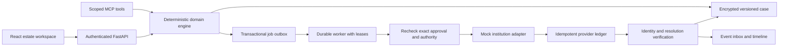

# Architecture and recovery

## Trust boundaries

The browser supplies a requested action and an expected case version. The server obtains the approver from its signed session and the recipient from the institution record. A packet binds its action, asset identity, authority version, requirements version, immutable record versions/hashes, and recipient. The worker verifies these again before consuming approval and dispatching. Approval expires after 15 minutes and can be revoked before dispatch.

Documents are evidence, never instructions. Only original trusted fixture letters can be accepted by the mock authority-review procedure. A stable full synthetic reference and owner identifier are required for merging records; name or masked-reference matches alone cannot merge assets. Candidate ownership stays unverified until the institution confirms it.

The Cedar policy's named beneficiary is different from the estate representative. Cedar permits an inquiry and returns disputed authority. The workflow records a human-review handoff without inferring entitlement or including the policy's face value in recovery.

## Durable state

Case mutations run in database transactions and compare the expected case version. The encrypted aggregate and encrypted event record commit with the job outbox. Unique constraints cover case event sequence, provider request reference, provider case reference, provider event ID and action/job binding.

The worker leases a job for 30 seconds. Before a write or replay it queries the provider using the original persisted request reference. A timeout after acceptance leaves the action unknown. On restart an expired lease can be claimed; the existing provider result is reconciled without consuming a second approval or generating a new write reference. Missing results can retry only the same immutable authorized request via provider idempotency. Backoff is bounded; repeated transport failures cause manual review. Manual review is not a successful resolution.

Provider callbacks require HMAC-SHA256 over the exact body and the configured secret. A callback is only a notification: its request reference causes an authoritative lookup in the mock ledger. Its asserted amount or destination is never trusted. Duplicate event IDs are ignored. Reconciliation requires asset identity, institution, request, environment and provider case reference to match.

## Provider capabilities

- **In-process mock:** requirement fixtures, inquiry/claim writes, lookup by request, lookup by provider reference, persistent idempotency, simulated resolutions and controlled clock.
- **Independent HTTP mock:** authenticated writes and request/resolution lookup; requirement templates remain the application's shared versioned fixtures. This service uses the same PostgreSQL instance for its separate provider ledger in Docker, so it is process-isolated, not an independently trusted production data source.
- **Sandbox / production:** not implemented. No capabilities advertised.
- **A2A:** optional in the supplied plan and not enabled.

The fixture clock normally follows UTC. Advancing it freezes it at the selected instant; advance it again to trigger later leases, delays or expiry. In Docker all services read the same controlled clock. It never changes the host's system clock or session expiry.

## Protocol and package revisions

MCP JSON-RPC tools use revision **2025-11-25**, with stateless POST requests at `/v1/mcp`, `initialize`, `notifications/initialized`, `ping`, `tools/list`, and `tools/call`. The HTTP-only local session cookie is required; this is a local tools endpoint, not a public OAuth-enabled MCP deployment. Clients must present the authenticated cookie. SSE subscriptions, resources and prompts are not implemented. Tool results include source, retrieval time and the `simulated` classification. The rules baseline has a maximum five-tool budget. The frontend lockfile and `requirements.lock.txt` pin installed dependencies.

The implementation follows the primary [MCP tools specification](https://modelcontextprotocol.io/specification/2025-11-25/server/tools), [FastAPI security documentation](https://fastapi.tiangolo.com/tutorial/security/), and [SQLAlchemy transaction documentation](https://docs.sqlalchemy.org/en/20/core/connections.html). Institution rules are fixtures, not statements of US or California law.
