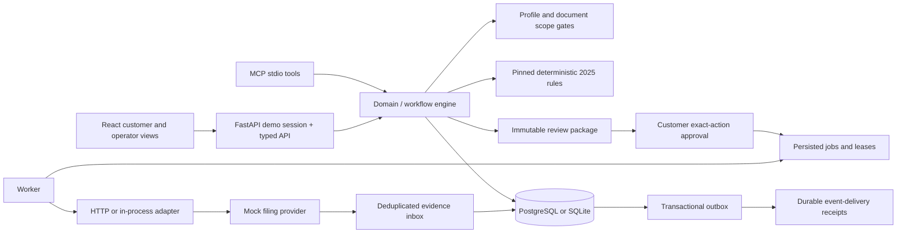

# Architecture and trade-offs

The case aggregate stores profile, source forms, facts, calculation history, package references, financial evidence and concise tool runs in a versioned JSON document. Actions, jobs, sessions, events, event inbox, outbox, delivery receipts, provider submissions and matched account credits have relational uniqueness constraints. This deliberately uses an aggregate rather than all proposed normalized tables; one migration supports SQLite development and PostgreSQL Compose.

Every mutation supplies an expected case version. Every material transition appends actor, timestamp, previous/next state, expected version and evidence. Database transactions serialize writers (SQLite `BEGIN IMMEDIATE`; a PostgreSQL transaction-level advisory lock). This is appropriate for the prototype and trades throughput for understandable invariants.

The worker claims a durable job with a lease and consumes exact-action authority before committing. Provider calls occur afterward, outside that transaction. A crash after provider persistence is recovered by looking up the original client request reference. A timeout is an unknown outcome, never evidence that a return did not submit. Bounded retries eventually hold the job for operator review. Replay reuses the same consumed approval, action hash and request reference; it cannot manufacture a new authorization.

A correction before submission invalidates the package and revokes approval. Edits are blocked while a submission is in flight. A document arriving after acceptance opens an out-of-scope amendment-review record and preserves the submitted calculation. Original source amounts and the amended interpretation remain separately inspectable.

Outbox delivery is to a local durable evidence-receipt projection, with uniqueness on event ID. It sends no user notifications. HTTP provider callbacks use HMAC-SHA256 over `timestamp.body`, allow five minutes of skew and are deduplicated by event ID plus payload hash. A refund requires acceptance, an amount matching the approved calculation and a unique account-credit reference. A notice alone is not sufficient. Balance due has no payment executor.

## Provider capabilities

- In-process mock: validates, submits, looks up by original reference, simulates rejection, delayed acceptance, refund notice and account credit; supports controlled clock, timeout-after-acceptance and malformed replies.
- Separate HTTP mock: same capabilities, private bearer token, provider calls outside application transactions; included in Compose.
- Government sandbox: no integration exists and no capability is advertised.
- Production IRS or banking: no integration exists; the only destination is the mock filing service.

## Tax rule provenance

`rules/2025/manifest.json` pins the archived instructions (February 25, 2026 revision), Publication 1040 HTML, the March 11 instruction update and the derived table with SHA-256 hashes. Extraction checks every one of the 2,062 single-filer rows against the archived PDF. The March update concerns excluded Schedule 1-A instructions. Calculations verify source checksums and include the manifest hash; approval verification repeats that check.

Rounding is half-up to whole dollars after summing cents per imported line. Total income is the sum of rounded wages and interest; tax comes from the applicable table row. Social Security and Medicare withholding never enter federal income-tax withholding. No bracket approximation substitutes for the Tax Table.

## Boundaries still requiring production work

This is not a independently certified tax engine. Professional review of the supported profile and reference returns remains open. Synthetic records do not need a production PII vault; accepting real taxpayer data would require encrypted storage, identity controls, access review, retention/deletion policies, applicable preparer obligations and a reviewed live integration. The demo-session endpoint must not become production authentication. The operator and customer screens share one demo owner, not separate production roles.

The concierge is deterministic and asks for missing evidence; MCP exposes those capabilities to an external agent without approval tools. No LLM accuracy, token-cost or model-versus-baseline claim is made. Adding a model means implementing the structured tool-caller interface and running separate held-out evaluations.
